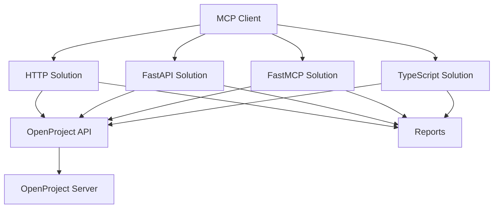

# OpenProject MCP Integration Documentation

Welcome to the comprehensive documentation for the OpenProject MCP (Model Context Protocol) integration solutions. This project provides multiple approaches to integrate OpenProject with AI assistants and other MCP-compatible clients.

## 🚀 Quick Start

Choose your preferred solution:

- **[HTTP Solution](solutions/http-solution.md)** - Production-ready synchronous implementation
- **[FastAPI Solution](solutions/fastapi-solution.md)** - Development-friendly async implementation
- **[FastMCP Solution](solutions/fastmcp-solution.md)** - MCP-native streaming implementation  
- **[TypeScript Solution](solutions/typescript-solution.md)** - Frontend-focused TypeScript SDK

## 📋 Prerequisites

- OpenProject instance (self-hosted or cloud)
- API key from OpenProject
- Python 3.8+ (for Python solutions)
- Node.js 16+ (for TypeScript solution)

## 🎯 Key Features

- **Multi-Solution Architecture**: Choose the right solution for your needs
- **MCP Protocol Support**: Full compatibility with MCP specification
- **Real-time Updates**: WebSocket and SSE support
- **Internationalization**: Multi-language support
- **Production Ready**: Docker, Kubernetes, and cloud deployment options
- **Comprehensive API**: RESTful APIs with OpenAPI documentation

## 🏗️ Architecture Overview

## 📚 Documentation Structure

### Getting Started
- [Overview](getting-started/overview.md) - Learn about the project and its goals
- [Quick Start](getting-started/quick-start.md) - Get up and running in minutes
- [Installation](getting-started/installation.md) - Detailed installation instructions
- [Configuration](getting-started/configuration.md) - Configure your environment

### Architecture
- [Architecture Guide](architecture.md) - Comprehensive architecture documentation
- [Solution Comparison](architecture/solution-comparison.md) - Compare solution types
- [System Design](architecture/system-design.md) - Deep dive into system design
- [Performance](architecture/performance.md) - Performance characteristics and optimization

### Solutions
- [HTTP Solution](solutions/http-solution.md) - Production-ready HTTP implementation
- [FastAPI Solution](solutions/fastapi-solution.md) - Modern async FastAPI implementation
- [FastMCP Solution](solutions/fastmcp-solution.md) - Native MCP implementation
- [TypeScript Solution](solutions/typescript-solution.md) - TypeScript SDK for frontend integration

### Implementation
- [Implementation Examples](implementation.md) - Code examples and patterns
- [Code Samples](implementation/code-samples.md) - Detailed code samples
- [Best Practices](implementation/best-practices.md) - Development best practices
- [Patterns](implementation/patterns.md) - Common implementation patterns

### Deployment
- [Deployment Guide](deployment.md) - Complete deployment guide
- [Docker Deployment](deployment/docker.md) - Docker deployment options
- [Kubernetes Deployment](deployment/kubernetes.md) - Kubernetes deployment
- [Cloud Deployment](deployment/cloud.md) - Cloud platform deployment
- [Production Setup](deployment/production.md) - Production configuration

### API Documentation
- [API Overview](api.md) - API documentation overview
- [HTTP API](api/http-api.md) - HTTP solution API reference
- [FastAPI API](api/fastapi-api.md) - FastAPI solution API reference
- [MCP Protocol](api/mcp-protocol.md) - MCP protocol documentation
- [TypeScript SDK](api/typescript-sdk.md) - TypeScript SDK reference
- [Authentication](api/authentication.md) - Authentication and authorization

### Operations
- [Operational Runbooks](operations.md) - Production operations guide
- [Monitoring](operations/monitoring.md) - Monitoring and observability
- [Maintenance](operations/maintenance.md) - Maintenance procedures
- [Backup & Recovery](operations/backup-recovery.md) - Backup and recovery
- [Security](operations/security.md) - Security operations

### Internationalization
- [i18n Overview](internationalization.md) - Internationalization overview
- [Translation Management](internationalization/translation-management.md) - Managing translations
- [Localization](internationalization/localization.md) - Localization features
- [Testing](internationalization/testing.md) - Testing internationalization

### Troubleshooting
- [Troubleshooting Guide](troubleshooting.md) - Comprehensive troubleshooting guide
- [Common Issues](troubleshooting/common-issues.md) - Solutions to common problems
- [FAQ](troubleshooting/faq.md) - Frequently asked questions
- [Debugging](troubleshooting/debugging.md) - Debugging techniques

### Reference
- [Configuration Reference](reference/configuration.md) - Complete configuration reference
- [Error Codes](reference/error-codes.md) - Error codes and messages
- [Environment Variables](reference/environment-variables.md) - Environment variables
- [API Reference](reference/api-reference.md) - Complete API reference

### Contributing
- [Contributing Guide](contributing.md) - How to contribute
- [Development Setup](contributing/development-setup.md) - Setting up development environment
- [Testing](contributing/testing.md) - Testing guide
- [Documentation](contributing/documentation.md) - Documentation guide
- [Release Process](contributing/release-process.md) - Release process

## 🤝 Contributing

We welcome contributions! Please see our [Contributing Guide](contributing.md) for details.

## 📄 License

This project is licensed under the MIT License - see the [LICENSE](LICENSE) file for details.

## 🆘 Support

- **Documentation**: You're reading it!
- **GitHub Issues**: Report bugs and request features
- **Community**: Join our community discussions
- **Professional Support**: Available for enterprise customers

## 🔗 Related Links

- [OpenProject](https://www.openproject.org/)
- [MCP Specification](https://modelcontextprotocol.io/)
- [FastAPI Documentation](https://fastapi.tiangolo.com/)
- [Docker Documentation](https://docs.docker.com/)

---

**Next Steps**: Choose your solution and follow the [Quick Start](getting-started/quick-start.md) guide!